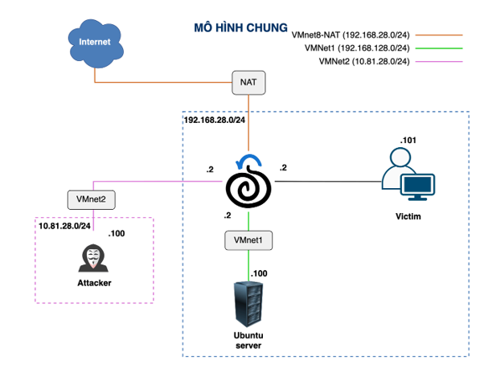

# Security Onion SIEM & Threat Hunting Platform


## Overview

This project demonstrates the deployment and operation of a Security Information and Event Management (SIEM) and Threat Hunting platform using Security Onion 3.1.

The lab simulates a small enterprise environment consisting of attacker, victim, and server. Security Onion is deployed as both a network sensor and routing gateway to provide centralized visibility, network monitoring, threat detection, and incident investigation capabilities.

## Objectives

* Deploy a functional SIEM and Threat Hunting environment
* Monitor network traffic across multiple segments
* Detect malicious activities using IDS alerts
* Perform packet analysis and log correlation
* Investigate security incidents using Security Onion tools

## Repository Structure

```text
security-onion-soc-lab/
│
├── img/
│   └── topology.png 
│
├── Group7_Report.pdf 
│
└── README.md

```

## Network Topology


## Demo
https://drive.google.com/drive/folders/1nuw2-vEpGuQg6_JZD1JRX2KrWp0MpUmj?usp=sharing

## Technologies Used

* Security Onion 3.1
* Suricata IDS
* Elasticsearch
* Kibana
* Security Onion Hunt
* Cases Management
* PCAP Capture
* VMware Workstation
* Kali Linux
* Metasploitable
* Windows 11

## Key Features Explored

### Security Monitoring

* Real-time IDS alert monitoring
* Alert triage and validation

### Threat Hunting

* Investigation using Hunt interface
* Network artifact analysis

### Log Management

* Centralized log collection
* Event correlation using Kibana

### Packet Analysis

* Full packet capture (PCAP)
* Deep inspection of suspicious traffic

### Incident Management

* Case creation and evidence tracking

## Attack Scenarios

### Network Reconnaissance

Performed Nmap scans against the internal network to simulate attacker reconnaissance activities.

Detection Sources:

* Suricata IDS Alerts
* Full Packet Capture (PCAP)

### SSH Brute Force Attack

Simulated credential attacks against SSH services using password dictionaries.

Detection Sources:

* Suricata Alerts
* Elasticsearch Logs
* Kibana Dashboards

## Key Findings

* Security Onion provides strong visibility across multiple network segments.
* Combining IDS alerts with packet captures significantly improves investigation quality.
* Centralized log correlation accelerates threat analysis and incident response.

## Skills Demonstrated

* SIEM Operations
* Threat Hunting
* Log Analysis
* Network Monitoring
* IDS Management
* Incident Investigation
* Security Event Correlation

